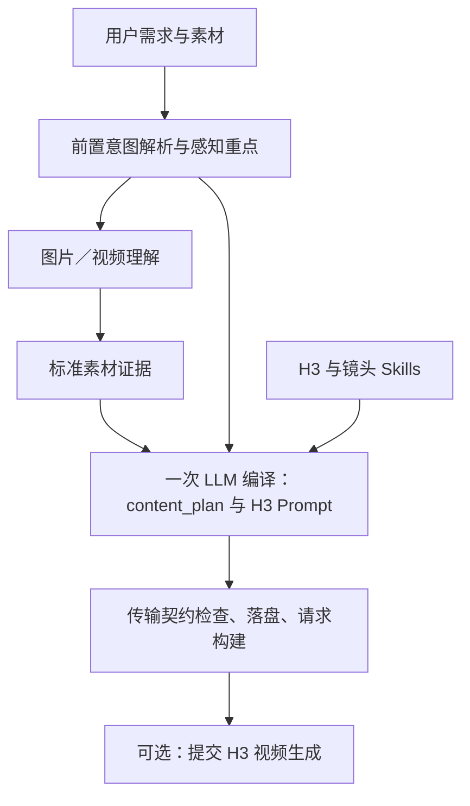

# MiniMax-H3 Context-IR

将用户需求和参考素材编译为 H3 Prompt 与视频请求。素材理解、Prompt 生成和视频提交相互独立，可分别使用。

## 当前版本

仓库编译器为 **v20**：`singlecall.v20.reference_inheritance`。新增必需保留、可选继承和有理由排除的区分，避免因素材主要用于人物身份，就自动丢弃可用背景。

**代码版本不等于线上部署版本。** 本次文档整理不重启服务；实际部署请查询 `GET /api/health` 的 `prompt_compiler`。v20 并不保证所有素材绑定或声音设计都正确，输出仍需结合视频核验。

## 从哪里开始

- [对外 API](docs/API.md)：请求结构、四种输入模式、视频提交。
- [当前工作流](docs/CURRENT_CONTEXT_IR_WORKFLOW.md)：真实阶段、产物及调用次数。
- [文档导航](docs/README.md)：当前说明与历史实验的区别。
- [案例归档规范](docs/CASE_OUTPUT_CONVENTION.md)：每个 Case 下保存不同版本结果。
- [视频对比页面](https://xingshen2.github.io/minimax-H3-context-IR/)：官方、Raw 与本地结果。

## 标准流程



正常 Prompt 编译阶段只调用一次 LLM，不再串行执行旧版语义草稿和最终导演。新素材仍有前置意图解析和 VLM 请求；底层异常修复可能增加请求，不能将整个流程称为严格一次调用。

## 接口

| 接口 | 职责 |
|---|---|
| `POST /api/h3/prompt` | 生成 Prompt 和请求，不自动生成视频 |
| `POST /api/h3/videos` | 提交视频任务 |
| `POST /api/context-ir/generate` | 组合编译与可选视频生成 |
| `POST /api/understand/image` | 独立图片理解 |
| `POST /api/understand/video` | 独立视频理解 |
| `POST /api/understand/audio` | 需配置音频感知提供方；Qwen 视觉服务不分析音轨 |

Prompt 接口支持 `assets`、`asset_descriptions`、`media_analysis`、`context_ir`。其中 `context_ir` 是旧 canonical IR 的兼容入口，不能直接传入新版 `h3_compilation.light.v1` 记录。具体示例见 API 文档。

```bash
curl -sS http://10.100.4.2:38080/api/health
curl -sS -X POST http://10.100.4.2:38080/api/h3/prompt \
  -H 'Content-Type: application/json' --data-binary @request.json
```

`request.json` 需符合 API 包装结构，不是任意历史输出 JSON。服务器与模型服务必须能够读取所填素材路径；Windows 路径不会自动成为远端可用路径。

## 模型与运行

当前验证使用 DeepSeek 与 Qwen3.8-27B，图片／视频服务地址为 9012，IR Web 服务为 38080。旧 provider 名称中可能仍含 `qwen3-vl-32b`，不能据此判断实际模型。

当前 Python LLM 运行时使用 Chat Completions；历史 Codex/Responses 配置仅作兼容，不是当前主流程依赖。密钥放在被 Git 忽略的 `deploy/context_ir.env`，不要提交到仓库。

v20 展示案例使用 65,536 token 输出预算；这是运行配置，不是模型实际输出长度，也不是源码在所有入口的默认值。`CONTEXT_IR_LLM_MAX_TOKENS` 应在实际进程中核实。

```bash
python3 -m pytest -q
bash deploy/web.sh
```

启动前配置环境文件，并检查容器素材挂载。启动服务与发布 GitHub Pages 是两个不同操作。

## 目录

| 目录 | 内容 |
|---|---|
| `backend/` | 当前编译、感知、API 与兼容实现 |
| `frontend/` | IR 操作界面 |
| `skills/` | Prompt 与镜头规划指令 |
| `deploy/` | 启动脚本与环境模板 |
| `docs/` | 当前文档及历史研究记录 |
| `scripts/` | 运维、验证和历史复现脚本，见其导航 |
| `tests/` | 自动化测试 |
| `examples/showcase/` | GitHub Pages 页面及已发布结果，不能当临时输出清理 |
| `assets/`、`outputs/` | 本地素材与运行产物；大规模案例应使用服务器统一数据目录 |

根目录 `agent.py`、`context_ir.py`、`perception.py` 保留为兼容入口。旧编译模块暂不删除，已有 canonical IR 和历史测试仍可能依赖它们。
