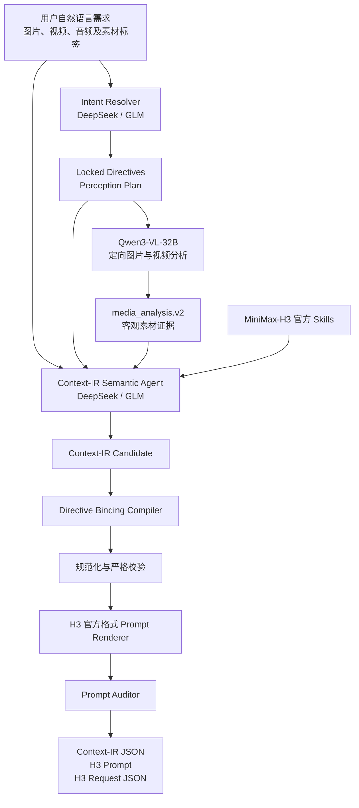

# MiniMax-H3 Context-IR Agent

面向 MiniMax-H3 多素材视频生成的 Context-IR 编译 Agent。用户只需提交自然语言需求和图片、视频等参考素材，系统会解析素材用途与继承边界，完成定向视觉理解、跨素材关系推理、确定性指令绑定、时间线编排和官方格式 Prompt 渲染，最终输出可验证、可追踪的 Context-IR、H3 Prompt 与服务请求。

当前推理 LLM 可在 DeepSeek 和 GLM 之间切换；视觉感知默认使用本地部署的 Qwen3-VL-32B。模型负责理解和推理，关键用户指令由程序级编译与校验锁定，避免只依赖语言模型“记住”约束。

完整设计与字段说明见 [当前 Context-IR 工作流](docs/CURRENT_CONTEXT_IR_WORKFLOW.md)。

## Project layout

```text
backend/     Python Agent, perception providers, Context-IR compiler, Web API
frontend/    Independent browser interface
assets/      Uploaded/request media grouped by case
skills/      Official MiniMax-H3 Skills
deploy/      Container launchers and local environment templates
outputs/     Generated Context-IR, H3 Prompt, audit, and request files
```

The root `agent.py`, `context_ir.py`, and `perception.py` files remain as
backward-compatible entry points; active implementations live in `backend/`.

## Architecture



各层职责：

- **Intent Resolver**：先理解用户明确指定的素材用途、替换关系、保持项、禁止项和镜头要求，并生成 VLM 应重点观察的问题。
- **Qwen3-VL 感知层**：只提取图片与视频中的客观证据，不负责决定最终创意；视频默认按 2 FPS 解码并保留实际时间语义。
- **Semantic Agent**：结合用户原始需求、锁定指令和素材证据，推理资产角色、引用隔离、状态变化、连续性与时间线。
- **Directive Binding Compiler**：把用户已明确指定的要求编译为程序级强绑定，防止后续模型输出偏离重点。
- **Renderer 与 Auditor**：生成 MiniMax-H3 官方三段式或六段式 Prompt，并检查引用、主体、时间线、商品重点与禁止项。

视觉分析标准输出为 `media_analysis.v2`。传入已有 perception 缓存时可以跳过 VLM，便于重复调试 IR；测试 VLM 准确性时应禁用缓存重新分析。音频目前会保留在素材清单中，但 Qwen 视觉层不分析音轨，后续可接入独立音频感知模型。

## Run

Put each request's media under `assets/case_NNN/` using the `images`, `videos`,
and `audio` subfolders. Start from `assets/case_001/request.json`; media paths
must use the absolute `/home/mx/shenxing/minimax-H3-context-IR/assets/...`
form so they resolve identically on the host and in the container.

Prepare an input JSON from `examples/request.example.json`, then run:

```bash
cd /home/mx/shenxing/minimax-H3-context-IR
bash deploy/run.sh examples/request.example.json
```

For the included case template:

```bash
bash deploy/run.sh assets/case_001/request.json
```

用户不需要手写完整 Context-IR。最小请求只需自然语言和素材清单，例如：

```json
{
  "user_request": "参考视频的运镜和展示结构，为图片中的商品制作一条15秒竖屏广告，商品外观不要改变。",
  "task": {
    "type": "ref2va",
    "duration_seconds": 15,
    "aspect_ratio": "9:16",
    "generate_audio": false,
    "style": "premium commercial, photorealistic"
  },
  "assets": [
    {
      "asset_id": "image_1",
      "media_type": "image",
      "uri": "/absolute/path/product.png",
      "label": "Picture 1 - product appearance"
    },
    {
      "asset_id": "video_1",
      "media_type": "video",
      "uri": "/absolute/path/reference.mp4",
      "label": "Video 1 - camera movement and structure only"
    }
  ]
}
```

如果用户提供了更详细的分镜、素材继承范围或状态切换要求，系统会把这些内容视为高优先级指令；只对未指定但生成所必需的部分进行保守补全。

## Web studio

Start the independent frontend and upload API from the same project folder:

```bash
bash deploy/web.sh
```

Then open `http://<aigc-host>:38080`. The interface accepts natural-language
requirements and drag-and-drop media, assigns image/video/audio numbers,
captures each asset's intended role, creates a new `assets/case_NNN`, and runs
the same Codex Agent pipeline. Generated files remain under `outputs/` and are
available in Context-IR, H3 Prompt, and audit tabs.

The interface is an independent implementation inspired by the interaction
patterns of the MIT-licensed `ComfyUI-MiniMaxH3-Prompt-Writer`; it does not
depend on ComfyUI or copy its runtime integration.

Results are written to a timestamped folder under `outputs/` unless `--output-dir` is provided.
The normalized visual evidence is saved as `media_analysis.json`; model
reasoning text and Base64 image payloads are never written to outputs.
主要产物包括：

```text
intent_resolution.json   用户指令锁定与定向感知计划
media_analysis.json      Qwen 客观素材分析（media_analysis.v2）
context_ir.json          规范化并通过校验的 Context-IR
h3_prompt.txt            可直接提交给 H3 的官方格式 Prompt
h3_prompt_audit.json     Prompt 审计结果、错误与警告
h3_request.json          MiniMax-H3 服务请求
```

Each successful run includes `h3_prompt_audit.json`. Base tasks
(`T2VA/I2VA/FL2VA/L2VA`) use the official three-section structure, while
`Ref2VA` uses the official six-section structure. H3 reference labels are
derived deterministically from final condition order.

Check the Codex runtime and GLM gateway without running an Agent turn:

```bash
bash deploy/run.sh --preflight-only
```

Use an official style Skill when relevant:

```bash
bash deploy/run.sh request.json --style-skill minimalist-product-ad-generator
```

Validate without calling GLM:

```bash
bash deploy/run.sh --validate-only outputs/<run>/context_ir.json
```

## Runtime configuration

Visual perception defaults to the locally deployed Qwen3-VL-32B FIFO service:

- `CONTEXT_IR_VLM_PROVIDER`: default `local-qwen3-vl-32b`
- `YIWU_VLM_BASE_URL`: default `http://127.0.0.1:9012`
- `YIWU_VLM_MODEL`: default `Qwen3-VL-32B-Instruct`
- `CONTEXT_IR_VIDEO_FPS`: default `2`
- `CONTEXT_IR_VIDEO_MAX_FRAMES`: default `256`
- `CONTEXT_IR_VLM_TIMEOUT_SECONDS`: default `1800`

As with the `yiwu_codex` launcher, runtime values may be kept in a local env
file. Copy `deploy/context_ir.env.example` to `deploy/context_ir.env`, add the
key there, and keep that file uncommitted. An already exported environment
variable takes precedence over the file.

Local image and video absolute paths are submitted directly to the service.
The service copies each input into its FIFO task directory and uses Qwen's
native video utility to decode chronological frames; audio tracks are not
analyzed. The previous `gitee-qwen3-vl` contact-sheet adapter remains available
as an explicit provider fallback.

The Codex Agent supports switchable reasoning providers through the Responses API.
Set `CONTEXT_IR_LLM_PROVIDER=deepseek` or
`CONTEXT_IR_LLM_PROVIDER=glm` in `deploy/context_ir.env`.

GLM configuration:

- `GLM_MODEL` default: `GLM-5.2`
- `GLM_PROVIDER_ID` default: `glm`
- `GLM_RESPONSES_BASE_URL` default: `http://127.0.0.1:38041/v1`
- `GLM_HTTP_HOST` default: `litellm-poc.pgw.metax-tech.com`
- `OPENAI_API_KEY`: required LiteLLM bearer key
- wire API: `responses`

DeepSeek configuration:

- `DEEPSEEK_MODEL` default: `deepseek-v4-flash`
- `DEEPSEEK_PROVIDER_ID` default: `deepseek`
- `DEEPSEEK_RESPONSES_BASE_URL` default: `https://api.deepseek.com`
- `DEEPSEEK_API_KEY`: required official DeepSeek API key
- wire API: `responses`

DeepSeek's official Responses endpoint is directly compatible with Codex and
does not use the GLM LiteLLM tunnel. Switching providers does not affect the
Qwen perception stage or the deterministic Context-IR validation pipeline.

Keep the real LiteLLM key only in the ignored `deploy/context_ir.env` file.
Because `aigc` cannot resolve the LiteLLM intranet hostname, Windows supplies
network access through an SSH reverse tunnel:

```powershell
Start-Process ssh -ArgumentList @(
  "-N", "-T",
  "-o", "ExitOnForwardFailure=yes",
  "-o", "ServerAliveInterval=30",
  "-o", "ServerAliveCountMax=3",
  "-R", "38041:litellm-poc.pgw.metax-tech.com:80",
  "aigc"
) -WindowStyle Hidden
```

`GLM_HTTP_HOST` preserves the original virtual-host routing while Codex calls
the tunnel through `127.0.0.1:38041`.

The Docker **container** is named `minimax_h3_context_ir`. By default the
launcher reuses the existing **image** `yiwu_codex:latest` only as the Codex
SDK runtime; these are deliberately different concepts. Override the image
with `CONTEXT_IR_IMAGE`, for example:

```bash
CONTEXT_IR_IMAGE=minimax-h3-context-ir:latest bash deploy/run.sh request.json
```

The mounted project remains independent and does not depend on
`/home/mx/shenxing/yiwu_codex`.

The LiteLLM Responses gateway is an external prerequisite only when GLM is
selected. The runner does not start or manage it.
