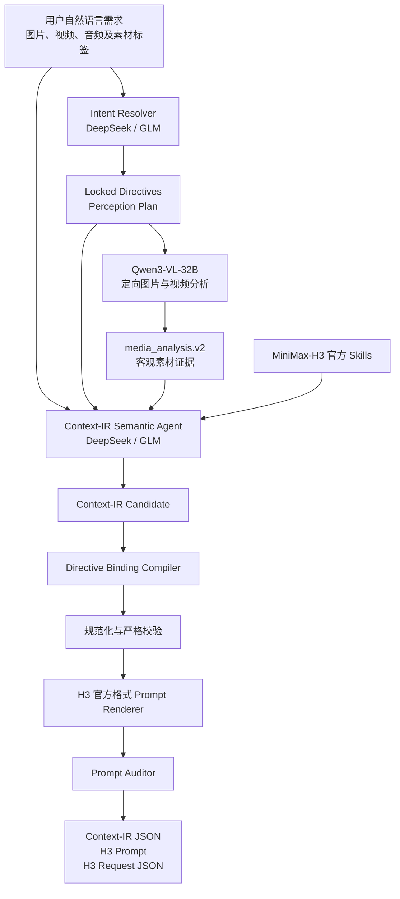

# MiniMax-H3 Context-IR Agent

面向 MiniMax-H3 多素材视频生成的 Context-IR 编译 Agent。用户只需提交自然语言需求和图片、视频等参考素材，系统会解析素材用途与继承边界，完成定向视觉理解、跨素材关系推理、确定性指令绑定、时间线编排和官方格式 Prompt 渲染，最终输出可验证、可追踪的 Context-IR、H3 Prompt 与服务请求。

当前推理 LLM 可在 DeepSeek 和 GLM 之间切换；视觉感知默认使用本地部署的 Qwen3-VL-32B。模型负责理解和推理，关键用户指令由程序级编译与校验锁定，避免只依赖语言模型“记住”约束。

完整设计与字段说明见 [当前 Context-IR 工作流](docs/CURRENT_CONTEXT_IR_WORKFLOW.md)。

## API 分层

对外接口按“完整业务能力”和“可复用基础能力”分层。普通调用方只需要使用稳定业务接口，不需要了解素材证据标准化等内部步骤。

### 稳定业务接口

| 接口 | 用途 |
|---|---|
| `POST /api/h3/prompt` | 从原始素材、素材描述、标准分析或已有 IR 生成 Context-IR、H3 Prompt、审计和 H3 Request |
| `POST /api/h3/videos` | 提交 H3 Request，并可选等待视频生成完成 |
| `POST /api/context-ir/generate` | 组合 Prompt 编译与可选视频生成 |

`/api/h3/prompt` 是普通用户的推荐入口，支持四种 `input_type`：

| input_type | 输入 | 系统行为 |
|---|---|---|
| `assets` | 原始图片、视频或音频 | 调用素材理解模型后生成 Prompt |
| `asset_descriptions` | 人工或外部系统提供的自然语言素材描述 | 不调用 VLM，内部标准化后生成 Prompt |
| `media_analysis` | 标准 `media_analysis.v2` | 校验并复用分析结果 |
| `context_ir` | 已有合法 Context-IR | 仅渲染、审计和构建请求 |

使用自然语言素材描述的最小示例：

```bash
curl -X POST http://10.100.4.2:38080/api/h3/prompt \
  -H "Content-Type: application/json" \
  -d '{
    "input_type": "asset_descriptions",
    "source": {
      "user_request": "用图片中的香水制作15秒高级竖屏广告，保持瓶身、瓶盖和标签文字不变。",
      "task": {
        "type": "ref2va",
        "duration_seconds": 15,
        "aspect_ratio": "9:16",
        "generate_audio": true
      }
    },
    "asset_descriptions": [
      {
        "asset_id": "image_1",
        "media_type": "image",
        "uri": "/shared/assets/perfume.png",
        "description": "透明玻璃香水瓶，黑色斜切瓶盖，标签文字为 LUMEN 07。"
      }
    ]
  }'
```

完整协议、返回字段、所有公开接口和调用示例见 [Context-IR 对外 API 使用文档](docs/API.md)。

### 可选通用理解接口

这些接口供其他 Agent、Skill 或素材系统复用，不直接生成 H3 Prompt：

| 接口 | 输出 |
|---|---|
| `POST /api/understand/image` | 图片实体、属性、关系、区域证据和不确定性 |
| `POST /api/understand/video` | 视频事件、实际时间线、动作、镜头和剪辑结构 |
| `POST /api/understand/audio` | 音频证据；当前需配置真正的音频感知模型 |

`media_evidence_normalize` 只保留为内部函数，由 `/api/h3/prompt` 自动调用，不再要求用户先请求一个中间接口。能力清单可通过 `GET /api/capabilities` 查询。

## 项目结构

```text
backend/     Python Agent、感知适配器、Context-IR 编译器与 Web API
frontend/    独立浏览器界面
assets/      按案例组织的上传与请求素材
skills/      MiniMax-H3 官方 Skills
deploy/      容器启动脚本与本地环境配置模板
outputs/     生成的 Context-IR、H3 Prompt、审计与请求文件
```

根目录下的 `agent.py`、`context_ir.py` 和 `perception.py` 作为向后兼容入口保留；当前实际实现位于 `backend/`。

## 整体架构



各层职责：

- **Intent Resolver**：先理解用户明确指定的素材用途、替换关系、保持项、禁止项和镜头要求，并生成 VLM 应重点观察的问题。
- **Qwen3-VL 感知层**：只提取图片与视频中的客观证据，不负责决定最终创意；视频默认按 2 FPS 解码并保留实际时间语义。
- **Semantic Agent**：结合用户原始需求、锁定指令和素材证据，推理资产角色、引用隔离、状态变化、连续性与时间线。
- **Directive Binding Compiler**：把用户已明确指定的要求编译为程序级强绑定，防止后续模型输出偏离重点。
- **Renderer 与 Auditor**：生成 MiniMax-H3 官方三段式或六段式 Prompt，并检查引用、主体、时间线、商品重点与禁止项。

视觉分析标准输出为 `media_analysis.v2`。传入已有 perception 缓存时可以跳过 VLM，便于重复调试 IR；测试 VLM 准确性时应禁用缓存重新分析。音频目前会保留在素材清单中，但 Qwen 视觉层不分析音轨，后续可接入独立音频感知模型。

## 运行方法

将每个请求的素材放在 `assets/case_NNN/` 下，并分别使用 `images`、`videos` 和 `audio` 子目录。可以从 `assets/case_001/request.json` 开始；素材路径应使用 `/home/mx/shenxing/minimax-H3-context-IR/assets/...` 形式的绝对路径，确保宿主机与容器内解析结果一致。

参考 `examples/request.example.json` 准备输入 JSON，然后运行：

```bash
cd /home/mx/shenxing/minimax-H3-context-IR
bash deploy/run.sh examples/request.example.json
```

运行仓库自带的案例模板：

```bash
bash deploy/run.sh assets/case_001/request.json
```

用户不需要手写完整 Context-IR。最小请求只需自然语言和素材清单，例如：

```json
{
  "user_request": "参考视频的运镜和展示结构，为图片中的商品制作一条15秒竖屏广告，商品外观不要改变。",
  "task": {
    "type": "ref2va",
    "duration_seconds": 15,
    "aspect_ratio": "9:16",
    "generate_audio": true,
    "style": "premium commercial, photorealistic"
  },
  "assets": [
    {
      "asset_id": "image_1",
      "media_type": "image",
      "uri": "/absolute/path/product.png",
      "label": "图片1 - 商品外观"
    },
    {
      "asset_id": "video_1",
      "media_type": "video",
      "uri": "/absolute/path/reference.mp4",
      "label": "视频1 - 仅参考运镜和展示结构"
    }
  ]
}
```

如果用户提供了更详细的分镜、素材继承范围或状态切换要求，系统会把这些内容视为高优先级指令；只对未指定但生成所必需的部分进行保守补全。

## Web 操作界面

在项目目录中启动独立前端与素材上传 API：

```bash
bash deploy/web.sh
```

然后打开 `http://<aigc-host>:38080`。界面支持自然语言需求和拖放素材，会自动为图片、视频和音频编号，记录每份素材的预期用途，创建新的 `assets/case_NNN`，并运行同一套 Codex Agent 流程。生成文件保存在 `outputs/` 下，可在 Context-IR、H3 Prompt 和审计标签页中查看。

该界面参考了 MIT 许可项目 `ComfyUI-MiniMaxH3-Prompt-Writer` 的交互方式，但属于独立实现，不依赖 ComfyUI，也没有复制其运行时集成。

默认情况下，结果会写入 `outputs/` 下按时间戳命名的目录；也可以通过 `--output-dir` 指定输出位置。规范化后的视觉证据保存在 `media_analysis.json` 中；模型推理文本和 Base64 图片载荷不会写入输出目录。
主要产物包括：

```text
intent_resolution.json   用户指令锁定与定向感知计划
media_analysis.json      Qwen 客观素材分析（media_analysis.v2）
context_ir.json          规范化并通过校验的 Context-IR
h3_prompt.txt            可直接提交给 H3 的官方格式 Prompt
h3_prompt_audit.json     Prompt 审计结果、错误与警告
h3_request.json          MiniMax-H3 服务请求
```

每次成功运行都会生成 `h3_prompt_audit.json`。基础任务（`T2VA/I2VA/FL2VA/L2VA`）使用官方三段式结构，`Ref2VA` 使用官方六段式结构。H3 引用标签根据最终条件顺序确定性生成。

仅检查 Codex 运行环境和 GLM 网关，不执行 Agent 推理：

```bash
bash deploy/run.sh --preflight-only
```

需要指定官方风格 Skill 时：

```bash
bash deploy/run.sh request.json --style-skill minimalist-product-ad-generator
```

不调用 GLM，仅校验已有 Context-IR：

```bash
bash deploy/run.sh --validate-only outputs/<run>/context_ir.json
```

## 运行配置

视觉感知默认使用一个统一部署的 Qwen3-VL-32B 服务。图片和视频请求进入
同一全局 FIFO，再由 GPU `2,3` 与 `4,5` 两个 Worker 并行处理：

- 图片 → `image_url`
- 视频 → `video_url`

- `CONTEXT_IR_VLM_PROVIDER`：默认值 `local-qwen3-vl-32b`
- `QWEN_IMAGE_UNDERSTAND_BASE_URL`：默认值 `http://127.0.0.1:9012`
- `QWEN_VIDEO_UNDERSTAND_BASE_URL`：兼容配置项，默认与图片相同，为 `http://127.0.0.1:9012`
- `YIWU_VLM_BASE_URL`：旧版兼容回退地址，默认值 `http://127.0.0.1:9012`
- `YIWU_VLM_MODEL`：默认值 `Qwen3-VL-32B-Instruct`
- `CONTEXT_IR_VIDEO_FPS`：默认值 `2`
- `CONTEXT_IR_VIDEO_MAX_FRAMES`：默认值 `256`
- `CONTEXT_IR_VLM_TIMEOUT_SECONDS`：默认值 `1800`

与 `yiwu_codex` 启动方式一致，运行参数可以保存在本地环境文件中。将 `deploy/context_ir.env.example` 复制为 `deploy/context_ir.env`，在其中填写密钥，并确保该文件不进入版本控制。系统中已经导出的环境变量优先于文件内配置。

Context-IR 通过统一服务的 OpenAI 风格同步入口
`POST /v1/chat/completions` 调用 Qwen。图片使用标准 `image_url` 内容块；
视频使用 Qwen 的 `video_url` 多模态扩展。IR 中的本地绝对路径会转换为
受限的 `file://` URL，仍由服务复制到持久化 FIFO 任务目录，因此不会绕过
原有队列、恢复和审计机制。对外系统应使用 HTTP(S) 素材 URL；图片也支持
Base64 Data URL。

图片请求结构示例：

```json
{
  "model": "Qwen3-VL-32B-Instruct",
  "messages": [{
    "role": "user",
    "content": [
      {"type": "text", "text": "提取客观可见证据，输出指定 JSON。"},
      {
        "type": "image_url",
        "image_url": {"url": "https://assets.example.com/product.png"}
      }
    ]
  }],
  "max_tokens": 2048,
  "temperature": 0,
  "stream": false
}
```

标准响应正文位于 `choices[0].message.content`，内部任务号位于扩展字段
`x_task_id`。当前部署不支持 `stream=true`；返回的 `usage` 是估算值，并以
`x_usage_estimated=true` 明确标记。服务同时保留 `/submit`、`/status` 和
`/download`，供需要异步任务管理及服务器绝对路径的内部调用使用。

服务使用 Qwen 原生视频工具按时间顺序解码帧；当前不分析音轨。原有
`gitee-qwen3-vl` 联系表适配器仍可作为显式指定的备用感知提供方。

Codex Agent 通过 Responses API 支持切换推理模型。默认使用 LiteLLM
提供的 `deepseek-v4-flash`；在 `deploy/context_ir.env` 中设置
`CONTEXT_IR_LLM_PROVIDER=deepseek_litellm`、`deepseek` 或 `glm`。

默认 DeepSeek LiteLLM 配置：

- `DEEPSEEK_LITELLM_MODEL`：默认值 `deepseek-v4-flash`
- `DEEPSEEK_LITELLM_PROVIDER_ID`：默认值 `deepseek_litellm`
- `DEEPSEEK_LITELLM_RESPONSES_BASE_URL`：默认值 `http://litellm-poc.pgw.metax-tech.com/v1`
- `LITELLM_API_KEY`：LiteLLM Bearer Key；未设置时启动脚本兼容复用 `OPENAI_API_KEY`
- 传输 API：`responses`

GLM 配置：

- `GLM_MODEL`：默认值 `GLM-5.2`
- `GLM_PROVIDER_ID`：默认值 `glm`
- `GLM_RESPONSES_BASE_URL`：默认值 `http://127.0.0.1:38041/v1`
- `GLM_HTTP_HOST`：默认值 `litellm-poc.pgw.metax-tech.com`
- `OPENAI_API_KEY`：必填，LiteLLM Bearer Key
- 传输 API：`responses`

DeepSeek 官方 API 配置（可选）：

- `DEEPSEEK_MODEL`：默认值 `deepseek-v4-flash`
- `DEEPSEEK_PROVIDER_ID`：默认值 `deepseek`
- `DEEPSEEK_RESPONSES_BASE_URL`：默认值 `https://api.deepseek.com`
- `DEEPSEEK_API_KEY`：必填，DeepSeek 官方 API Key
- 传输 API：`responses`

选择 `CONTEXT_IR_LLM_PROVIDER=deepseek` 时，DeepSeek 官方 Responses
端点可以直接与 Codex 配合使用。切换推理模型不会影响 Qwen 感知阶段和
确定性的 Context-IR 校验流程。

真实 API Key 只应保存在已忽略的 `deploy/context_ir.env` 文件中。默认
LiteLLM 地址可由 `aigc` 服务器直接访问，不需要 Windows SSH 反向隧道。

旧的 GLM 本地代理方案仍可按需使用：

```powershell
Start-Process ssh -ArgumentList @(
  "-N", "-T",
  "-o", "ExitOnForwardFailure=yes",
  "-o", "ServerAliveInterval=30",
  "-o", "ServerAliveCountMax=3",
  "-R", "38041:litellm-poc.pgw.metax-tech.com:80",
  "aigc"
) -WindowStyle Hidden
```

Codex 通过 `127.0.0.1:38041` 调用隧道时，`GLM_HTTP_HOST` 用于保留原始虚拟主机路由。

Docker **容器**名称为 `minimax_h3_context_ir`。默认情况下，启动脚本只复用现有 **镜像** `yiwu_codex:latest` 作为 Codex SDK 运行环境；容器与镜像是两个不同概念。可以通过 `CONTEXT_IR_IMAGE` 覆盖镜像，例如：

```bash
CONTEXT_IR_IMAGE=minimax-h3-context-ir:latest bash deploy/run.sh request.json
```

挂载后的项目保持独立，不依赖 `/home/mx/shenxing/yiwu_codex`。

选择 GLM 本地代理时仍需要外部 LiteLLM Responses 网关；项目启动脚本
不会启动或管理该网关。
