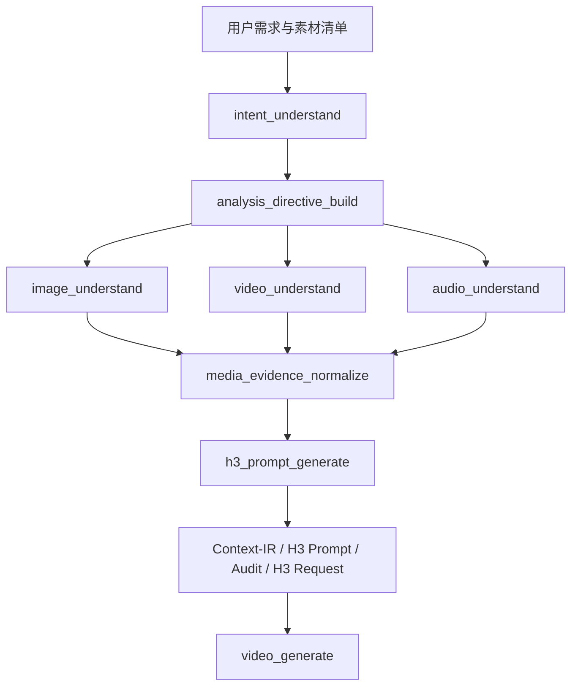

# Context-IR 原子能力与组合工作流

Context-IR 是业务意图、多模态素材与 MiniMax-H3 之间的结构化编排层。默认运行时采用 Python Orchestrator 和无工具 Chat Completions，不依赖 Codex；Codex 仅作为可选的高级自主运行时保留。

## 能力分层



### 通用理解能力

- `image_understand(asset, config, analysis_directive=None)`
- `video_understand(asset, config, analysis_directive=None)`
- `audio_understand(asset, config, analysis_directive=None)`
- `media_evidence_normalize(raw, assets, config)`

前置 LLM 不生成自由形式的 VLM Prompt。它只生成结构化 `analysis_directive`；感知适配器使用固定系统规则和确定性模板将该指令编译进 Qwen Prompt。用户声称、预期角色和真实观察必须分开，无法观察的证据写入 `unresolved`。

这些能力不依赖 H3 Schema，可被视频复刻、广告片、商品理解等其他 Skill 复用。视觉模型不得声称分析音频；在没有音频模型适配器时，`audio_understand` 必须返回明确的 unsupported 状态。

### H3 Prompt 生成能力

`h3_prompt_generate` 对 Agent 或上游编排器作为一个完整工具暴露，内部保留以下阶段用于测试和追踪：

```text
intent_resolve
analysis_directive_build
directive_bind
reference_isolate
timeline_compile
continuity_compile
context_ir_validate
h3_prompt_render
h3_prompt_audit
h3_request_build
```

工具通过显式 `input_type` 选择执行起点：

| input_type | 必需输入 | 执行范围 |
|---|---|---|
| `assets` | `source.assets` | 意图规划、素材理解、IR 编译、渲染、审计、请求构建 |
| `asset_descriptions` | `source`、`asset_descriptions` | 将自然语言素材描述标准化为 `media_analysis.v2`，再执行 IR 编译、渲染、审计和请求构建 |
| `media_analysis` | `source`、`media_analysis.v2` | 跳过素材理解，从 IR 编译开始 |
| `context_ir` | `context_ir` | 仅渲染、审计和请求构建 |

服务严格校验声明与输入结构。上游结果在输出中标记为 `caller_supplied`，系统生成的结果标记为 `generated`；主要产物同时记录规范化内容的 SHA-256，便于缓存、复用、审计和问题追踪。

### 视频生成能力

`video_generate` 接收完整 H3 Request 或 `h3_prompt_generate` 输出，负责：

- 提交 `/v1/videos`；
- 查询任务状态；
- 等待完成并返回结果。

Prompt 编译默认不提交视频，避免编译重试造成昂贵的重复生成。

### 组合能力

`context_ir_generate` 串联 `h3_prompt_generate` 和可选的 `video_generate`。调用方必须显式设置 `generate_video=true` 才会提交 H3 任务。

## HTTP 接口

```text
GET  /api/capabilities

稳定业务接口：
POST /api/h3/prompt
POST /api/h3/videos
POST /api/context-ir/generate

可选通用理解接口：
POST /api/understand/image
POST /api/understand/video
POST /api/understand/audio
```

`media_evidence_normalize` 是 `h3_prompt_generate` 内部的数据适配步骤，不作为 HTTP 接口单独暴露。`assets` 和 `asset_descriptions` 会自动完成标准化；`media_analysis` 只进行 Schema 校验。

从原始素材开始：

```json
{
  "input_type": "assets",
  "source": {
    "user_request": "参考视频的运镜，为图片中的商品生成广告。",
    "task": {
      "type": "ref2va",
      "duration_seconds": 15,
      "aspect_ratio": "9:16",
      "generate_audio": true
    },
    "assets": [
      {"asset_id": "image_1", "media_type": "image", "uri": "/absolute/product.png"},
      {"asset_id": "video_1", "media_type": "video", "uri": "/absolute/reference.mp4"}
    ]
  }
}
```

## 可替换模型边界

- LLM runtime 只需实现 JSON 输入输出，不需要工具调用。
- VLM adapter 只需输出统一 `media_analysis.v2`。
- H3 renderer 和 auditor 是确定性的，不依赖模型。
- Codex、DeepSeek、GLM、Qwen 和 H3 服务都不是 Schema 的组成部分。

因此更换 LLM、VLM 或 H3 服务地址不会改变上层能力协议。

项目全部公开接口、返回协议与调用示例见 [Context-IR 对外 API 使用文档](API.md)。
