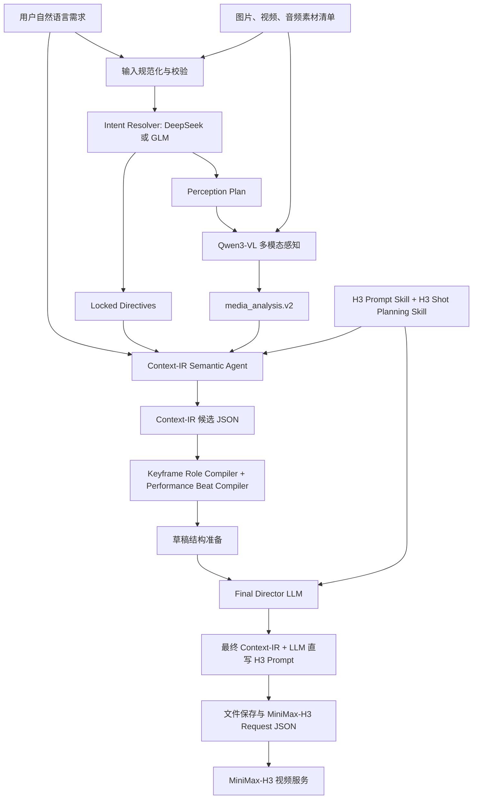

# MiniMax-H3 Context-IR 当前方案

## 1. 目标

Context-IR 是多素材视频生成任务的结构化编译层。它接收用户自然语言、图片、视频、音频和输出要求，建立素材角色、继承范围、隔离规则、状态变化与时间线，最终输出符合 MiniMax-H3 Prompt 规范、可验证且可追踪的生成请求。

系统的核心原则是：

- 用户明确要求具有最高优先级，不能被视觉模型或推理模型弱化；
- 多模态模型只报告可见或可听证据，不决定最终继承关系；
- LLM 负责语义理解、跨素材推理和创意编排；
- 确定性代码负责整理权威输入字段、稳定素材 ID、图片角色合法性、视频时间映射和跨层引用，不参与创意判断；
- 语义 IR 编译通过后整体锁定，受约束 Prompt LLM 只负责表达和官方格式，不得改变用户意图；
- 程序不对镜头审美或 Prompt 内容作通过/失败判断；
- 每个中间产物落盘，支持复用、对比和问题定位。

## 2. 总体架构



## 3. 输入契约

统一输入 schema 为 `context_request.v1`，主要字段包括：

```json
{
  "schema_version": "context_request.v1",
  "user_request": "用户自然语言需求",
  "task": {
    "type": "ref2va",
    "duration_seconds": 15,
    "aspect_ratio": "9:16",
    "generate_audio": true,
    "style": ""
  },
  "assets": [
    {
      "asset_id": "image_product",
      "media_type": "image",
      "uri": "/absolute/path/product.jpg",
      "label": "商品外观参考"
    }
  ],
  "directives": [],
  "completion_policy": {
    "technical": true,
    "conservative_semantic": true,
    "creative": false
  }
}
```

输入首先由 `normalize_source_request()` 规范化，再由 `validate_source_request()` 检查素材 ID、directive 冲突、任务字段和补全策略。

## 4. Intent Resolver

Intent Resolver 在 Qwen 分析素材之前运行，使用当前配置的 DeepSeek 或 GLM。它只读取用户文字和素材 manifest，不读取原始图片或视频。

输出包括：

- `resolved_request`：忠实、可执行的用户需求复述；
- `directives`：用户明确要求形成的锁定指令；
- `completion_policy`：允许的技术、语义和创意补全范围；
- `perception_plan`：每份素材的定向分析计划；
- `open_questions`：无法安全消解的歧义。

示例：

```json
{
  "directives": [
    {
      "directive_id": "d_product",
      "asset_id": "image_product",
      "target": "target product appearance",
      "operation": "preserve",
      "scope": ["shape", "color", "pattern", "decoration"],
      "priority": "hard",
      "provenance": "explicit_user"
    }
  ],
  "perception_plan": {
    "assets": [
      {
        "asset_id": "image_product",
        "role": "authoritative_product_appearance",
        "user_claimed_category": "press-on nail set",
        "analyze": ["per-piece geometry", "color", "pattern", "3D decoration"],
        "do_not_infer": ["brand", "price", "unsupported function"]
      }
    ]
  }
}
```

已由上游提供的 directives 不允许被 Resolver 修改或重排。Resolver 失败时任务明确终止，不会静默退回空约束。

## 5. Qwen3-VL 感知层

当前生产 Provider 为 `local-qwen3-vl-32b`，模型为 `Qwen3-VL-32B-Instruct`，通过 HTTP 服务调用：

```text
POST /submit
GET  /status/{task_id}
GET  /health
```

服务地址默认是 `http://127.0.0.1:9012`。Context-IR 后端提交素材绝对路径、提示词、输出目录和推理参数，然后轮询任务状态。

### 5.1 图片流程

图片默认采用两阶段分析：

```text
原图
→ 开放词汇目标定位和 bounding boxes
→ 独立对象裁剪与 crop sheet
→ 每个对象的几何、颜色、材质、表面、组件和标志性特征
→ evidence、regions、entities
```

Intent Resolver 生成的 `analyze` 和 `do_not_infer` 会注入定位与属性两个 Pass。用户声明的类别仅作为搜索假设，不能代替视觉证据。

图片感知默认启用两项无损加速：最多同时分析两个素材，以匹配当前两个 Qwen Worker；并按照素材内容 SHA256、模型、分析模式、检查计划、关键推理参数和缓存 schema 生成缓存键。完全兼容的视觉证据可直接复用，素材内容或检查要求变化时会自动失效。复杂图片的属性 crop 默认每批最多三个对象，并允许两个批次并行，降低长 JSON 截断后重试的概率。

### 5.2 视频流程

视频使用原始文件路径，由服务按约 2 fps 解码，默认最多 256 帧。分析分为：

```text
Timeline Pass
→ 镜头、动作、切换、真实秒数

Entity Pass
→ 人物、商品、服装、场景、道具、可见文字与关系

Deterministic Expansion
→ media_analysis.v2 events、entities、relations、evidence
```

系统通过 `ffprobe` 获取真实视频时长，要求事件使用源视频秒数，而不是帧序号或 0–1 归一化时间。Qwen ID 中 `entity3/entity_3` 一类无歧义标点漂移会被确定性规范化。

### 5.3 感知输出

所有 Provider 统一输出 `media_analysis.v2`：

```json
{
  "schema_version": "media_analysis.v2",
  "assets": [
    {
      "asset_id": "video_1",
      "summary": "...",
      "evidence": [],
      "entities": [],
      "relations": [],
      "events": [],
      "technical": {},
      "uncertainties": []
    }
  ]
}
```

Qwen 只提供证据，不决定哪份素材控制身份、商品、动作或场景。

## 6. Context-IR Semantic Agent

DeepSeek/GLM 接收：

- 用户原始需求；
- Intent Resolver 的 resolved request 和 directives；
- 素材 manifest；
- Qwen `media_analysis.v2`；
- MiniMax 官方 `h3-prompt-writing` Skill；
- 常驻的内部 `h3-shot-planning` Skill，用于镜头功能、运镜、切换边界、节奏、去重和连续性。

LLM 负责：

- 判断 edit base、权威内容源和 scoped reference；
- 建立 canonical subjects；
- 为每张图片判断外观、场景、动作关键帧、商品细节、首尾帧、构图或风格角色；
- 把每个可用视频事件改写为目标世界中的动作语义，保留事件 ID，不自行换算时间；
- 在 `strict / reference / adaptive` 模式下完成镜头规划；
- 为每镜指定唯一功能、观众新增信息和切镜原因；
- 推断跨素材实体关系；
- 确定商品、人物、服装、动作、运镜、节奏和场景的控制范围；
- 处理素材污染和约束冲突；
- 编排可执行时间线；
- 判断裸手到佩戴、连接到断开、关闭到启动等状态变化；
- 生成候选 Context-IR JSON。

模型不能宣称直接看到原始素材，只能引用 Qwen 的结构化证据。

## 7. 草稿结构准备

第一阶段 LLM 候选进入确定性编译与语义锁定。它不判断镜头是否高级，只整理能够从 source directive 和输入结构直接确定的工程事实，并验证绑定、引用、时间线和约束。编译失败时，仅在这一语义阶段携带明确错误局部重试一次；通过后整份 Context-IR 不再允许下游模型修改。

主要职责：

- 删除 `global` 等不存在的素材引用；
- 恢复 directive 指定的真实 `asset_id`；
- hard directive 强制保持 hard priority；
- directive scope 完整进入 `inherit` 或 `exclude`；
- 全局 directive 路由到 `constraints`，不创建虚构素材；
- 生成或补齐对应的 isolation rule；
- 清除 timeline、subject、creative focus 中无效的 binding 引用；
- 确保结构型视频参考明确写出“不是外观来源”。
- 根据已锁定 Binding 补齐每张条件图片的分维度角色并阻止图片获得动作、运镜、剪辑或音乐控制权；
- 从 Qwen 事件读取源时间，用实测源视频时长映射到目标时长；
- 将 Performance Beat 挂载到相交的 Shot，但绝不根据 Beat 数量新增 Shot；
- 当最后一个可靠事件未覆盖源视频结尾时生成 `unresolved_tail`，禁止循环、均分或补写结局。

职责边界：程序不能猜素材角色、商品类别、人物身份或用户未表达的创意内容；它只锁定上游已经明确作出的语义决定，并阻止最终 Prompt 阶段越权改写。

## 8. Context-IR 核心结构

最终 IR 包含：

- `intent`：需求、directives、假设与不确定性；
- `task`：任务类型、时长、比例、音频和风格；
- `assets` 与 `perception`；
- `asset_bindings`：每份素材控制和排除的属性；
- `subjects`：跨镜头稳定实体注册表；
- `reference_relationships`：图片、视频、音频的 H3 引用类型；
- `keyframe_roles`：图片作为外观来源、场景锚点、动作关键帧、商品细节、首尾帧、构图锚点或风格参考的明确职责；
- `performance_plan`：视频来源、允许迁移维度、源到目标时长映射及有证据的动作 Beat；
- `creative_focus`：最终视频的主视觉目标；
- `isolation_rules`：引用隔离规则；
- `constraints`：保持、允许变化和禁止内容；
- `timeline`：真正的 Shot、时间、相机、结束状态、状态变化及其 `beat_refs`；
- `audio_plan`；
- `generation_description`。

## 9. 状态与连续性

### 9.1 图片角色、Performance Beat 与 Shot 分层

三者不能相互替代：

```text
Picture → keyframe_roles：控制哪些静态视觉维度
Video event → performance_plan.beats：动作顺序、表情和表演节奏
timeline：真正的镜头边界、机位与剪辑结构
```

`action_keyframe` 必须引用一个已验证 Beat；静态图片不能单独声明动作时序。每个 Beat 的 `source_range` 和 `source_action` 由 Qwen 证据锁定，Semantic Agent 只能在 `action` 中完成用户要求的目标对象替换。确定性换算公式为：

```text
target_time = source_time / source_duration × target_duration
```

例如源视频 14 秒、目标 15 秒时，源时间 4 秒映射为目标时间约 4.286 秒。动作参考没有镜头授权时，全部 Beat 进入同一个连续 Shot，且 `editorial_boundary=false`。只有用户硬指令或已授权且可靠的真实切点可以形成剪辑边界。

源事件覆盖不足时只记录 `unresolved_tail`。该区间不会被均分、循环上一动作、推断完成状态或自动生成结尾。

每个镜头必须包含：

- 一个 `primary_change`；
- 一个可观察的 `observable_end_state`；
- 必要的 `state_changes`；
- `subject_refs`、`asset_refs` 和 `binding_refs`。

镜头规划遵循“先信息、后运镜”：先确定这一镜要让观众获得的新信息，再决定构图和相机。锁定机位足以完成目标时不添加运镜；使用运镜时必须有开始画面、动作或信息触发点、几何路径、速度幅度、结束画面和新增信息。切镜必须带来主体、视点、景别、空间、时间、动作状态或商品信息的实质变化，转场效果附着在相邻内容镜头边界，不单独占用镜头。

例如穿戴甲前后反差：

```text
0–3s: wearing_state = bare
3–4s: bare → worn
4–15s: wearing_state = worn
```

最终 Prompt 必须让后续镜头继续保持 `worn`，不能因切镜再次变成裸手、换指、替换或丢失商品。

当前状态判断主要由 LLM 根据用户要求和 Qwen event 文本完成；后续计划增加独立的 State Compiler，以确定性传播跨镜头状态。

## 10. 受约束 Prompt Compiler LLM

第二次 LLM 推理不是新的导演决策层，而是受约束的 Prompt 编译层。它接收：

- 用户原始需求、解析后的意图和硬约束；
- 精简后的素材证据；
- 已编译并锁定的 Context-IR；
- 草稿 H3 Prompt；
- `h3-prompt-writing` 与 `h3-shot-planning` Skills。

它只能在不改变语义的前提下压缩重复描述、把既有运镜写得可执行、明确素材属性范围，并直接输出 H3 Prompt。它不得新增、删除、合并、拆分、重排或重定时镜头，也不得修改主体主次、素材绑定、状态变化、文字策略、音频选择和用户约束。需要语义修改的问题必须返回第一阶段处理，不能在最终阶段静默修正。基础任务使用官方三段式结构，Ref2VA 使用六段式结构：

```text
subject_definitions
summary
retention_analysis
detailed_description
overall_soundscape
non_diegetic_music
```

## 统一生产策略层

Context-IR 在时间线编排前先生成 `production_policies` 权限矩阵。相机、剪辑、动作、表演、构图、光照、声音、风格、特效和文字统一使用 `strict / disabled / reference / enhance / auto` 五种模式，并记录决策来源、优先级、是否允许新增事件、是否保持参考以及所绑定的镜头。

确定性规范化遵循以下规则：

- 用户明确要求或禁止的策略为硬约束；
- 直接编辑源视频时，相机、剪辑、动作、光照和原音频默认按硬参考保持；
- 参考素材只能控制用户授权的维度；
- 动作、表情和表演节奏属于 performance 权限，不等同于运镜、镜头节奏或剪辑权限；
- 只有 motion/performance 权限的视频采用覆盖完整互动的连续单镜，不得自动产生手持、特写切换、硬切或转场；
- 只有意图解析明确生成 camera、shot rhythm、editing 或 transition 硬指令时，参考视频才获得对应镜头控制权；
- `auto` 使用最小新增原则，光照不默认增加动态事件；
- 特效和新增文字默认关闭；
- 启用音频时允许保守的技术性声景补全，但禁止无来源人声；
- `identity / product / continuity` 位于 `entity_constraints`，始终保持 `strict + hard`；
- 所有动态策略事件必须绑定到有效的时间线镜头。

类别先验只能形成软策略，不能覆盖商品真实性、人物身份、连续性、用户硬要求或编辑底片保持约束。
程序要求最终模型只返回非空字符串 `h3_prompt` 和数组 `optimization_notes`。即使模型额外返回 `context_ir` 也会被忽略。随后执行仅覆盖官方分段、引用标签、镜头编号、时间范围和确定性冲突的契约检查；不做主观审美打分，也不允许这一步修改语义 IR。

## 11. 运行产物与缓存

每次运行目录保存：

```text
input.json
intent_resolution.json
perception_plan.json
resolved_input.json
media_analysis.json
context_ir.json
h3_prompt.txt
h3_prompt_audit.json
h3_request.json
intent_resolver.log
agent.log
```

使用 `--perception-from /path/to/media_analysis.json` 可以复用已经完成的 Qwen 视觉证据。即使复用感知缓存，Intent Resolver 仍会针对本次用户请求重新运行；缓存只替代 Qwen，不复用旧 Context-IR 或旧 H3 Prompt。

## 12. 模型与部署

推理 LLM 可通过环境变量切换：

```text
CONTEXT_IR_LLM_PROVIDER=deepseek_litellm|deepseek|glm
```

当前支持：

- DeepSeek LiteLLM（默认）：模型 `deepseek-v4-flash`；
- DeepSeek 官方 API（可选）：模型 `deepseek-v4-flash`；
- GLM：默认模型 `GLM-5.2`；
- Qwen：本地 `Qwen3-VL-32B-Instruct`；
- 生成：MiniMax-H3。

主要环境变量：

```text
CONTEXT_IR_VLM_PROVIDER=local-qwen3-vl-32b
YIWU_VLM_BASE_URL=http://127.0.0.1:9012
YIWU_VLM_MODEL=Qwen3-VL-32B-Instruct
CONTEXT_IR_VIDEO_FPS=2
CONTEXT_IR_VIDEO_MAX_FRAMES=256
CONTEXT_IR_VLM_TIMEOUT_SECONDS=1800
CONTEXT_IR_VLM_CACHE_ENABLED=1
CONTEXT_IR_VLM_CACHE_DIR=/home/mx/shenxing/minimax-H3-context-IR/outputs/qwen3-vl-32b/cache
CONTEXT_IR_VLM_MAX_PARALLEL_ASSETS=2
CONTEXT_IR_VLM_MAX_PARALLEL_ATTRIBUTE_BATCHES=2
CONTEXT_IR_VLM_IMAGE_ATTRIBUTE_BATCH_SIZE=3
```

## 13. 当前优势

- 用户明确要求形成程序级锁定；
- Qwen 感知与 LLM 决策分离；
- 商品、身份和结构参考支持作用域隔离；
- 视频使用真实秒数；
- 感知缓存可复用；
- Context-IR 与 H3 Prompt 由独立的最终导演 LLM 统一优化；
- Context-IR 的结构错误由代码阻断；镜头表达等语义问题仅生成 warning；
- 编译 warning 会在同一次最终导演调用中处理，不额外增加一次 LLM 审核；
- 最终审计同时保留 warning 输入、LLM 处理状态和仍未解决的 warning；
- 运行产物可追踪；
- DeepSeek/GLM 可切换；
- 官方 H3 Prompt Skill 与镜头规划 Skill 同时提供给最终导演 LLM。

## 14. 当前已知问题

1. Prompt 仍可能过长并重复连续性要求，稀释商品视觉重点；
2. 部分 task、timeline 或 prohibit scope 可能被 LLM 绑定到商品图片，形成 Binding 语义污染；
3. 镜头审美仍取决于推理模型和 H3 执行效果；镜头矛盾不会阻断生成，但会作为 warning 返回；
4. Qwen 能在事件文本中识别状态变化，但 `state_before/state_after` 仍可能为空；
5. Qwen 分阶段图片分析耗时较长，同一素材流水线暂未并行；
6. 最终导演只优化 Prompt 表达，不能修改已锁定的素材绑定、Shot 顺序、时间、状态和用户硬约束；
7. LLM 最终优化仍不等价于生成视频质量评测，需要后续 VLM 审片闭环。

## 15. 下一步改进

优先级建议：

1. 增加 directive 语义路由，将 task、audio、timeline、continuity 和 appearance 分层；
2. 增加 State Compiler，从 Qwen事件和 LLM判断中生成并传播跨镜头状态；
3. 增加 Prompt 去重器，仅在必要镜头重复连续性要求；
4. 用真实 Case 校准 `strict / reference / adaptive` 镜头模式和合理镜头数量；
5. 对素材类别冲突增加 targeted second pass；
6. 建立“原始 Prompt / 当前 IR / 官方 IR”同 seed 视频 A/B 评测；
7. 使用商品保持率、状态连续率、引用污染率和审美质量作为视频级指标。

## 16. 代码位置

```text
backend/agent.py                主流程、LLM配置和运行入口
backend/intent_resolver.py      用户意图与 perception plan
backend/perception.py           Qwen Provider、图片/视频感知
backend/directive_binding.py    确定性 Directive Binding Compiler
backend/context_ir.py           草稿结构准备、旧版渲染兼容与 H3 Request 构建
backend/api.py                  Web API 与任务进度
skills/h3-prompt-writing/       MiniMax 官方 H3 Prompt Skill
skills/h3-shot-planning/        运镜、切镜、节奏与连续性规划 Skill
deploy/run.sh                   Docker CLI 运行入口
deploy/web.sh                   Web 服务入口
tests/                          输入、Binding、Renderer 与感知回归测试
```
