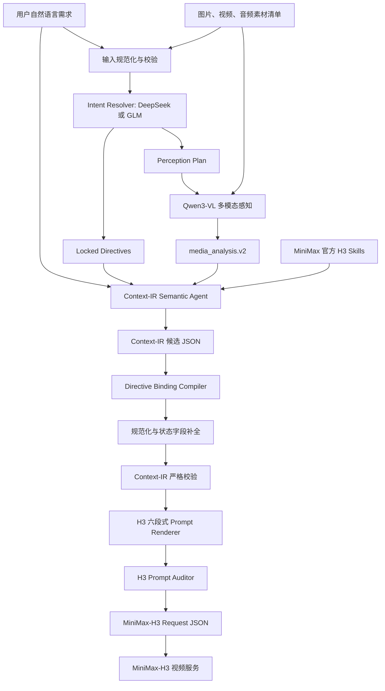

# MiniMax-H3 Context-IR 当前方案

## 1. 目标

Context-IR 是多素材视频生成任务的结构化编译层。它接收用户自然语言、图片、视频、音频和输出要求，建立素材角色、继承范围、隔离规则、状态变化与时间线，最终输出符合 MiniMax-H3 Prompt 规范、可验证且可追踪的生成请求。

系统的核心原则是：

- 用户明确要求具有最高优先级，不能被视觉模型或推理模型弱化；
- 多模态模型只报告可见或可听证据，不决定最终继承关系；
- LLM 负责语义理解、跨素材推理和创意编排；
- 确定性 Compiler 负责把模型判断转成稳定结构；
- H3 Prompt 从已校验的 Context-IR 确定性渲染，不由模型自由改写；
- 每个中间产物落盘，支持复用、审计、对比和问题定位。

## 2. 总体架构



## 3. 输入契约

统一输入 schema 为 `context_request.v1`，主要字段包括：

```json
{
  "schema_version": "context_request.v1",
  "user_request": "用户自然语言需求",
  "task": {
    "type": "ref2va",
    "duration_seconds": 15,
    "aspect_ratio": "9:16",
    "generate_audio": true,
    "style": ""
  },
  "assets": [
    {
      "asset_id": "image_product",
      "media_type": "image",
      "uri": "/absolute/path/product.jpg",
      "label": "商品外观参考"
    }
  ],
  "directives": [],
  "completion_policy": {
    "technical": true,
    "conservative_semantic": true,
    "creative": false
  }
}
```

输入首先由 `normalize_source_request()` 规范化，再由 `validate_source_request()` 检查素材 ID、directive 冲突、任务字段和补全策略。

## 4. Intent Resolver

Intent Resolver 在 Qwen 分析素材之前运行，使用当前配置的 DeepSeek 或 GLM。它只读取用户文字和素材 manifest，不读取原始图片或视频。

输出包括：

- `resolved_request`：忠实、可执行的用户需求复述；
- `directives`：用户明确要求形成的锁定指令；
- `completion_policy`：允许的技术、语义和创意补全范围；
- `perception_plan`：每份素材的定向分析计划；
- `open_questions`：无法安全消解的歧义。

示例：

```json
{
  "directives": [
    {
      "directive_id": "d_product",
      "asset_id": "image_product",
      "target": "target product appearance",
      "operation": "preserve",
      "scope": ["shape", "color", "pattern", "decoration"],
      "priority": "hard",
      "provenance": "explicit_user"
    }
  ],
  "perception_plan": {
    "assets": [
      {
        "asset_id": "image_product",
        "role": "authoritative_product_appearance",
        "user_claimed_category": "press-on nail set",
        "analyze": ["per-piece geometry", "color", "pattern", "3D decoration"],
        "do_not_infer": ["brand", "price", "unsupported function"]
      }
    ]
  }
}
```

已由上游提供的 directives 不允许被 Resolver 修改或重排。Resolver 失败时任务明确终止，不会静默退回空约束。

## 5. Qwen3-VL 感知层

当前生产 Provider 为 `local-qwen3-vl-32b`，模型为 `Qwen3-VL-32B-Instruct`，通过 HTTP 服务调用：

```text
POST /submit
GET  /status/{task_id}
GET  /health
```

服务地址默认是 `http://127.0.0.1:9012`。Context-IR 后端提交素材绝对路径、提示词、输出目录和推理参数，然后轮询任务状态。

### 5.1 图片流程

图片默认采用两阶段分析：

```text
原图
→ 开放词汇目标定位和 bounding boxes
→ 独立对象裁剪与 crop sheet
→ 每个对象的几何、颜色、材质、表面、组件和标志性特征
→ evidence、regions、entities
```

Intent Resolver 生成的 `analyze` 和 `do_not_infer` 会注入定位与属性两个 Pass。用户声明的类别仅作为搜索假设，不能代替视觉证据。

### 5.2 视频流程

视频使用原始文件路径，由服务按约 2 fps 解码，默认最多 256 帧。分析分为：

```text
Timeline Pass
→ 镜头、动作、切换、真实秒数

Entity Pass
→ 人物、商品、服装、场景、道具、可见文字与关系

Deterministic Expansion
→ media_analysis.v2 events、entities、relations、evidence
```

系统通过 `ffprobe` 获取真实视频时长，要求事件使用源视频秒数，而不是帧序号或 0–1 归一化时间。Qwen ID 中 `entity3/entity_3` 一类无歧义标点漂移会被确定性规范化。

### 5.3 感知输出

所有 Provider 统一输出 `media_analysis.v2`：

```json
{
  "schema_version": "media_analysis.v2",
  "assets": [
    {
      "asset_id": "video_1",
      "summary": "...",
      "evidence": [],
      "entities": [],
      "relations": [],
      "events": [],
      "technical": {},
      "uncertainties": []
    }
  ]
}
```

Qwen 只提供证据，不决定哪份素材控制身份、商品、动作或场景。

## 6. Context-IR Semantic Agent

DeepSeek/GLM 接收：

- 用户原始需求；
- Intent Resolver 的 resolved request 和 directives；
- 素材 manifest；
- Qwen `media_analysis.v2`；
- MiniMax 官方 `h3-prompt-writing` Skill；
- 可选风格 Skill。

LLM 负责：

- 判断 edit base、权威内容源和 scoped reference；
- 建立 canonical subjects；
- 推断跨素材实体关系；
- 确定商品、人物、服装、动作、运镜、节奏和场景的控制范围；
- 处理素材污染和约束冲突；
- 编排可执行时间线；
- 判断裸手到佩戴、连接到断开、关闭到启动等状态变化；
- 生成候选 Context-IR JSON。

模型不能宣称直接看到原始素材，只能引用 Qwen 的结构化证据。

## 7. Directive Binding Compiler

LLM 候选结果在严格校验前进入确定性 Binding Compiler。它不重新理解业务，只修复能够从 source directive 直接证明的结构事实。

主要职责：

- 删除 `global` 等不存在的素材引用；
- 恢复 directive 指定的真实 `asset_id`；
- hard directive 强制保持 hard priority；
- directive scope 完整进入 `inherit` 或 `exclude`；
- 全局 directive 路由到 `constraints`，不创建虚构素材；
- 生成或补齐对应的 isolation rule；
- 清除 timeline、subject、creative focus 中无效的 binding 引用；
- 确保结构型视频参考明确写出“不是外观来源”。

职责边界：Compiler 不能猜素材角色、商品类别、人物身份或用户未表达的创意内容。

## 8. Context-IR 核心结构

最终 IR 包含：

- `intent`：需求、directives、假设与不确定性；
- `task`：任务类型、时长、比例、音频和风格；
- `assets` 与 `perception`；
- `asset_bindings`：每份素材控制和排除的属性；
- `subjects`：跨镜头稳定实体注册表；
- `reference_relationships`：图片、视频、音频的 H3 引用类型；
- `creative_focus`：最终视频的主视觉目标；
- `isolation_rules`：引用隔离规则；
- `constraints`：保持、允许变化和禁止内容；
- `timeline`：镜头、时间、动作、相机、结束状态和状态变化；
- `audio_plan`；
- `generation_description`。

## 9. 状态与连续性

每个镜头必须包含：

- 一个 `primary_change`；
- 一个可观察的 `observable_end_state`；
- 必要的 `state_changes`；
- `subject_refs`、`asset_refs` 和 `binding_refs`。

例如穿戴甲前后反差：

```text
0–3s: wearing_state = bare
3–4s: bare → worn
4–15s: wearing_state = worn
```

最终 Prompt 必须让后续镜头继续保持 `worn`，不能因切镜再次变成裸手、换指、替换或丢失商品。

当前状态判断主要由 LLM 根据用户要求和 Qwen event 文本完成；后续计划增加独立的 State Compiler，以确定性传播跨镜头状态。

## 10. 校验、渲染与审计

`validate_context_ir()` 严格检查：

- 素材、directive、binding、subject 和镜头引用是否存在；
- hard directive 是否被弱化；
- scope 是否完整覆盖；
- motion/style/camera 引用是否正确隔离；
- 时间线是否从 0 开始、无重叠且精确结束；
- subject appearance 与 timeline 是否一致；
- 状态变化字段是否完整；
- 主视觉对象是否在必需镜头中真正呈现。

通过校验后，Renderer 生成 H3 六段式 Prompt：

```text
subject_definitions
summary
retention_analysis
detailed_description
overall_soundscape
non_diegetic_music
```

Prompt Auditor 再检查 H3 引用标签、Subject 定义、引用保留模式、结构参考隔离、时间戳、语言和音频一致性。只有审计通过才生成 `h3_request.json`。

## 11. 运行产物与缓存

每次运行目录保存：

```text
input.json
intent_resolution.json
perception_plan.json
resolved_input.json
media_analysis.json
context_ir.json
h3_prompt.txt
h3_prompt_audit.json
h3_request.json
intent_resolver.log
agent.log
```

使用 `--perception-from /path/to/media_analysis.json` 可以复用已经完成的 Qwen 视觉证据。即使复用感知缓存，Intent Resolver 仍会针对本次用户请求重新运行；缓存只替代 Qwen，不复用旧 Context-IR 或旧 H3 Prompt。

## 12. 模型与部署

推理 LLM 可通过环境变量切换：

```text
CONTEXT_IR_LLM_PROVIDER=deepseek|glm
```

当前支持：

- DeepSeek：默认模型 `deepseek-v4-flash`；
- GLM：默认模型 `GLM-5.2`；
- Qwen：本地 `Qwen3-VL-32B-Instruct`；
- 生成：MiniMax-H3。

主要环境变量：

```text
CONTEXT_IR_VLM_PROVIDER=local-qwen3-vl-32b
YIWU_VLM_BASE_URL=http://127.0.0.1:9012
YIWU_VLM_MODEL=Qwen3-VL-32B-Instruct
CONTEXT_IR_VIDEO_FPS=2
CONTEXT_IR_VIDEO_MAX_FRAMES=256
CONTEXT_IR_VLM_TIMEOUT_SECONDS=1800
```

## 13. 当前优势

- 用户明确要求形成程序级锁定；
- Qwen 感知与 LLM 决策分离；
- 商品、身份和结构参考支持作用域隔离；
- 视频使用真实秒数；
- 感知缓存可复用；
- Context-IR 与 H3 Prompt 均有严格审计；
- 运行产物可追踪；
- DeepSeek/GLM 可切换；
- 官方 H3 Skill 与确定性 Renderer 强绑定。

## 14. 当前已知问题

1. Prompt 仍可能过长并重复连续性要求，稀释商品视觉重点；
2. 部分 task、timeline 或 prohibit scope 可能被 LLM 绑定到商品图片，形成 Binding 语义污染；
3. 为追求稳定性，LLM 容易过度使用静态镜头，降低广告表现力；
4. Qwen 能在事件文本中识别状态变化，但 `state_before/state_after` 仍可能为空；
5. Qwen 分阶段图片分析耗时较长，同一素材流水线暂未并行；
6. 当前官方格式审计主要验证结构正确，不等价于最终视频质量评测。

## 15. 下一步改进

优先级建议：

1. 增加 directive 语义路由，将 task、audio、timeline、continuity 和 appearance 分层；
2. 增加 State Compiler，从 Qwen事件和 LLM判断中生成并传播跨镜头状态；
3. 增加 Prompt 去重器，仅在必要镜头重复连续性要求；
4. 在不影响锁定约束的前提下恢复适度 push-in、macro drift 等镜头自由度；
5. 对素材类别冲突增加 targeted second pass；
6. 建立“原始 Prompt / 当前 IR / 官方 IR”同 seed 视频 A/B 评测；
7. 使用商品保持率、状态连续率、引用污染率和审美质量作为视频级指标。

## 16. 代码位置

```text
backend/agent.py                主流程、LLM配置和运行入口
backend/intent_resolver.py      用户意图与 perception plan
backend/perception.py           Qwen Provider、图片/视频感知
backend/directive_binding.py    确定性 Directive Binding Compiler
backend/context_ir.py           IR规范化、校验、H3渲染和审计
backend/api.py                  Web API 与任务进度
skills/h3-prompt-writing/       MiniMax 官方 H3 Prompt Skill
deploy/run.sh                   Docker CLI 运行入口
deploy/web.sh                   Web 服务入口
tests/                          输入、Binding、Renderer 与感知回归测试
```
